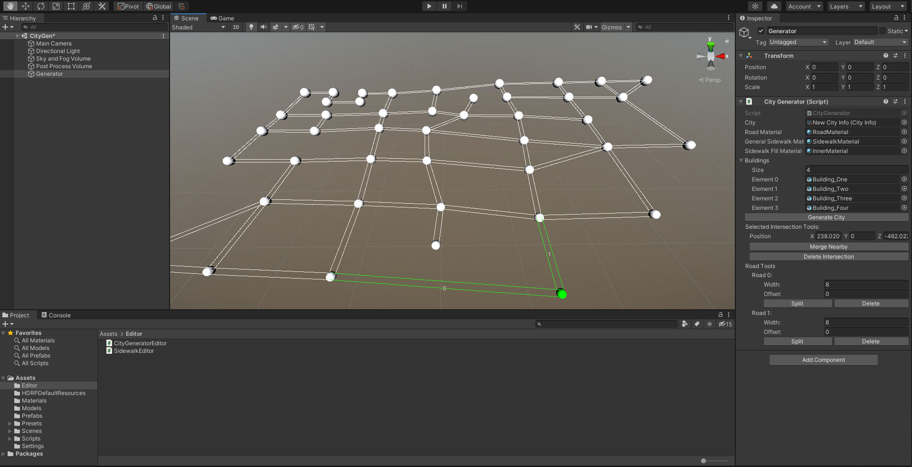
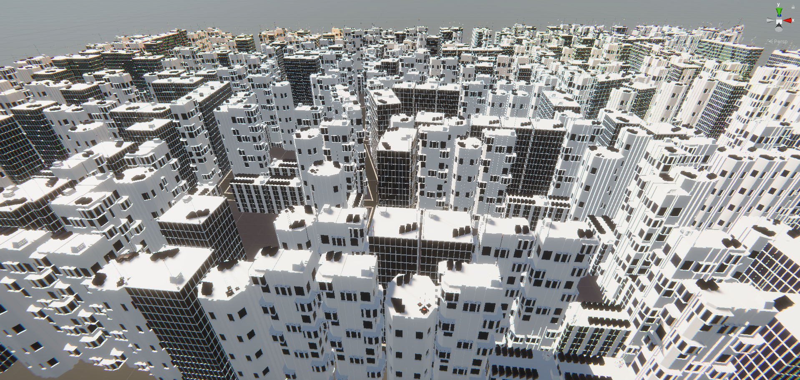
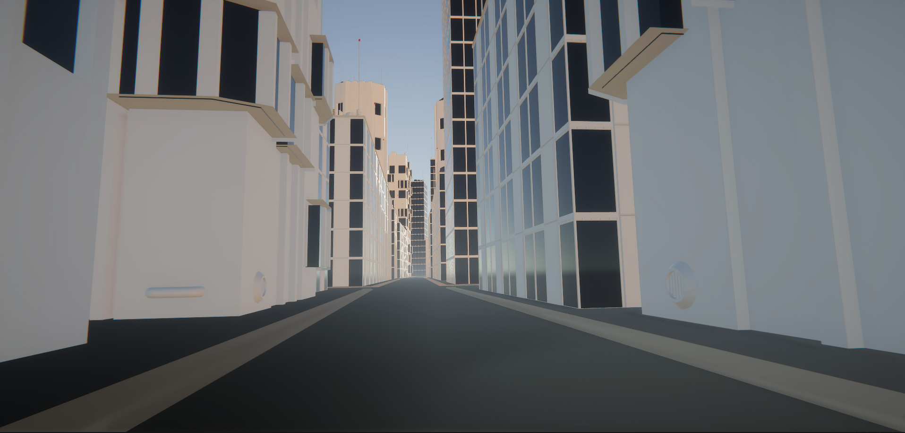

# CityBuilder
Unity Editor Tool for creating cities

Allows for creating roads in the unity scene by drawing out paths of nodes or "intersections." Intersections can be merged to allow for more than two roads to meet.

They can also be deleted. Roads can be split (To create another intersection in the middle) and deleted. The can have their width changed and be offset to the side.

When generated, a mesh will be created for each intersection and each road. Sidewalks will be created along each road. It comes with a trim and then raises up to the sidewalk height. It is an autogenerated mesh. A mesh will be generated in the area enclosed by each sidewalk. Along each sidewalk, buildings will be generated from a list of buildings supplied by the user.

This is what generation looks like using 4 building meshes:

Known Bugs:
- Buildings don't check for collisions with each other when being spawned. Causes buildings to spawn on each other at road corners.
- Sidewalk meshes don't have hard edges.

Planned Features:
- Building Types
Allow only certain building types to spawn near an intersection
	
- Special Buildings.
Allow a minimum and maximum of a building to be spawned in the city

- Bezier Sidewalks.
Use bezier curves and pre-created meshes to generate sidewalks for an overall cleaner looking solution.

- Add street lines

Quality of Life Improvements:
- Allow user to set intersection merge distance.

- Buildings Preview to allow for a better look at the final generation

- Inspector Overhaul.
Separation of tools into tabs (City, Intersection, Road, Preview)

- Use serialized objects and serialized properties to allow for undo-redo.

- Code optimization - Make the city hold a list of roads to eliminate some double loops and free up some memory during generation.
	
	
Things to look into:
- Bezier curve for roads.

- Support for Y axis cities.

- Multiselect on intersections.

- Selecting roads to edit their properties separately.